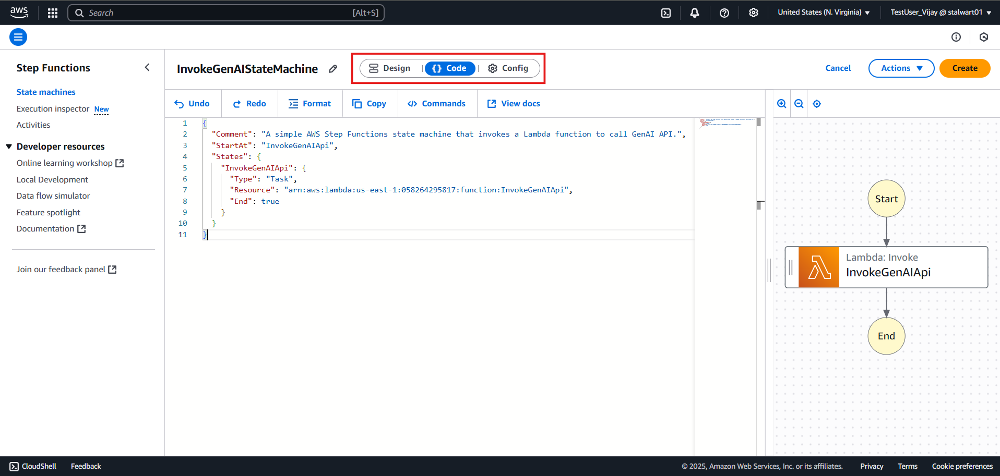
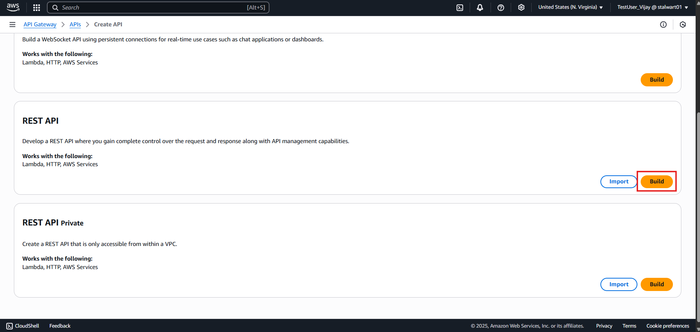

# **Integrating GenAI with Lambda, API Gateway, Step Functions**

* [**Create a IAM Role for API Gateway, Lambda, Step Functions, Bedrock and API Gateway**](#create-a-iam-role-for-api-gateway-lambda-step-functions-bedrock-and-api-gateway)
* [**Create a Lambda Function to Invoke the GenAI API**](#create-a-lambda-function-to-invoke-the-genai-api)
* [**Create a Step Function to Invoke the Lambda Function**](#create-a-step-function-to-invoke-the-lambda-function)
* [**Create an API Gateway to Trigger the Step Function**](#create-an-api-gateway-to-trigger-the-step-function)
* [**Test the API**](#test-the-api)

---

## **Create a IAM Role for API Gateway, Lambda, Step Functions, Bedrock and API Gateway**

**Step 1:** Go to the [IAM Console](https://console.aws.amazon.com/iam/home#/roles).

**Step 2:** Click on "Create role".

**Step 3:** Choose "Custom Trust Policy" and enter the following trust policy JSON:

```json
{
    "Version": "2012-10-17",
    "Statement": [
        {
            "Effect": "Allow",
            "Principal": {
                "Service": [
                    "apigateway.amazonaws.com",
                    "lambda.amazonaws.com"
                ]
            },
            "Action": "sts:AssumeRole"
        }
    ]
}
```


**Step 4:** Click "Next".

**Step 5:** Search for and select the following policies:

- `AmazonAPIGatewayAdministrator`
- `AmazonAPIGatewayPushToCloudWatchLogs`
- `AmazonBedrockFullAccess`
- `AWSStepFunctionsFullAccess`
- `AWSLambda_FullAccess`


**Step 6:** Click "Next: Tags" (optional) and then "Next: Review".

**Step 7:** Give your role a name (e.g., "`APIGatewayfromStepFunctions`") and description.


**Step 8:** Click "Create role".

## **Create a Lambda Function to Invoke the GenAI API**

**Step 1:** Go to the [AWS Lambda Console](https://console.aws.amazon.com/lambda/home).

**Step 2:** Click on "Create function".


**Step 3:** Choose "Author from scratch".

**Step 4:** Give your function a name (e.g., "`InvokeGenAIApi`") and choose the runtime (e.g., Python 3.x or latest).


**Step 5:** Under "Change default execution role", choose "Use an existing role" and select the role you created earlier (e.g., "`APIGatewayfromStepFunctions`").


**Step 6:** Click "Create function".

**Step 7:** In the function code editor, implement the logic to invoke the GenAI API. You can use the following sample code:

```python
import boto3
import json
from botocore.exceptions import ClientError

def lambda_handler(event, context):
    # 1. Get prompt from event
    input_prompt = event['prompt']
    print(input_prompt)

    # Create a Bedrock Runtime client in the AWS Region of your choice.
    client = boto3.client("bedrock-runtime", region_name="us-east-1")

    # Set the model ID, e.g., Mistral Large.
    model_id = "mistral.mistral-large-2402-v1:0"

    # Embed the prompt in Mistral's instruction format.
    formatted_prompt = f"<s>[INST] {input_prompt} [/INST]"

    # Format the request payload using the model's native structure.
    native_request = {
        "prompt": formatted_prompt,
        "max_tokens": 512,
        "temperature": 0.5
    }

    # Convert the native request to JSON.
    request = json.dumps(native_request)

    try:
        # Invoke the model with the request.
        response = client.invoke_model(
            modelId=model_id,
            body=request,
            contentType='application/json',
            accept='application/json'
        )

        # Decode the response body.
        model_response = json.loads(response["body"].read())

        # Extract and print the response text.
        response_text = model_response["outputs"][0]["text"]
        print(response_text)

        return {
            'statusCode': 200,
            'body': json.dumps(response_text)
        }

    except (ClientError, Exception) as e:
        print(f"ERROR: Can't invoke '{model_id}'. Reason: {e}")
        return {
            'statusCode': 500,
            'body': json.dumps(f"Error: {str(e)}")
        }
```

**Step 8:** Click "Deploy" to save your changes.


**Step 9:** Click on "`Configuration`" in the left menu, then select "`General configuration`".

**Step 10:** Click "`Edit`".


**Step 11:** Set the timeout to 1 minute 30 seconds (or as needed) and click "Save".


**Step 12:** Click "`Test`" from the right menu to create a test event.

**Step 13:** Click "Create new test event".


**Step 14:** Test your Lambda function by creating a test event. Use the following JSON as the test input:

```json
{
    "prompt": "What is Bedrock?"
}
```

**Step 15:** Click "Save changes" and then "Invoke".


**Step 16:** You should see the output in the "Execution result" section. If successful, it will return a response from the GenAI API.


---

## **Create a Step Function to Invoke the Lambda Function**

**Step 1:** Go to the [AWS Step Functions Console](https://console.aws.amazon.com/states/home).

**Step 2:** Click on "Create state machine".


**Step 3:** Create state machine window will open. Choose "Create from blank" and Name your state machine (e.g., "`InvokeGenAIStateMachine`") and state machine type as "Standard".


**Step 4:** Select Code editor and paste the following state machine definition:

```json
{
  "Comment": "A simple AWS Step Functions state machine that invokes a Lambda function to call GenAI API.",
  "StartAt": "InvokeGenAIApi",
  "States": {
    "InvokeGenAIApi": {
      "Type": "Task",
      "Resource": "arn:aws:lambda:us-east-1:<your-account-id>:function:InvokeGenAIApi",
      "End": true
    }
  }
}
```

**Step 5:** Replace `<your-account-id>` with your actual AWS account ID or use the ARN of your Lambda function.



**Step 6:** Click "Create".

**Step 7:** After the state machine is created, click on "State machine".

**Step 8:** Click on "Start execution".


**Step 9:** In the "Input" section, enter the following JSON to test your state machine:

```json
{
  "prompt": "What is Bedrock?"
}
```

**Step 10:** Click "Start execution".


**Step 11:** You should see the execution status as "Succeeded" and the output from the Lambda function in the "Event" section.


**Step 12:** You can click on the execution ID to view details.


---

## **Create an API Gateway to Trigger the Step Function**

**Step 1:** Go to the [API Gateway Console](https://console.aws.amazon.com/apigateway/home).

**Step 2:** Click on "Create API".


**Step 3:** On the Choose an API type page, in the REST API pane, choose Build.



**Step 4:** Choose "New API", give it a name (e.g., "`InvokeGenAIAPI`"), and click "Create API".


**Step 5:** In the left navigation pane, choose "Resources".

**Step 6:** Click on "Create Resource".


**Step 7:** Enter a resource name (e.g., "`invoke`") and click "Create Resource".


**Step 8:** With the new resource selected, click on "Create Method".


**Step 9:** Choose "POST" from the dropdown and click the checkmark.

**Step 10:** In the "Integration type" section, choose "AWS Service".


**Step 11:** iIn the "AWS Region" dropdown, select the region where your Step Function is located (e.g., `us-east-1`).

**Step 12:** In the "AWS Service" dropdown, select "Step Functions".

**Step 13:** In the "HTTP method" dropdown, select "POST".

**Step 14:** In the "Action Type" dropdown, select "Use Action name".

**Step 15:** In the "Action" field, enter `StartExecution`.

**Step 16:** In the "Execution role" field, Add the ARN of the IAM role you created earlier (e.g., `arn:aws:iam::<your-account-id>:role/APIGatewayfromStepFunctions`).

> **Note:** Get the ARN of the IAM role you created in the [Create a IAM Role for API Gateway, Lambda, Step Functions, Bedrock and API Gateway](#create-a-iam-role-for-api-gateway-lambda-step-functions-bedrock-and-api-gateway) section.


**Step 17:** Click "Create Method".


**Step 18:** Click "Deploy API".


**Step 19:** Choose *New Stage*.


**Step 20:** Enter a stage name (e.g., "`dev`") and click "Deploy".


**Step 21:** After deployment, you will see the "Invoke URL" for your API. Copy this URL.


---

## **Test the API**

To test the API, you can use a tool like Postman or cURL.

**Step 1:** Open Postman or your preferred API testing tool.

**Step 2:** Set the request type to POST.

**Step 3:** Paste the "Invoke URL" you copied earlier into the request URL field.

```
https://<api-id>.execute-api.<region>.amazonaws.com/dev/invoke
```

**Step 4:** In the "Body" section, select "raw" and choose "JSON" from the dropdown.

**Step 5:** Enter the following JSON in the body:

```json
{
   "input": "{\"prompt\": \"What is Step Function in AWS\"}",
   "stateMachineArn": "arn:aws:states:us-east-1:058264295817:stateMachine:InvokeGenAIStateMachine"
}
```


> **Note:** Get the `stateMachineArn` from the AWS Step Functions console. It should look like this:


**Step 6:** Click "Send".

**Step 7:** You should receive the execution ARN in the response.

```json
{
   "executionArn": "arn:aws:states:us-east-1:058264295817:execution:demo-step-function:12345678-1234-1234-1234-123456789012",
   "startDate": "2023-10-01T12:00:00.000Z"
}
```


**Step 8:** You can check the execution status in the AWS Step Functions console by using the execution ARN returned in the response.


**Step 9:** Select the execution ARN and under "Events" you can see the output of the Lambda function which invoked the GenAI API.


---